# 🎓 AcadTrack Pro


> 📊 **Academic Performance Tracking & Grade Prediction System for Engineering Colleges**

AcadTrack Pro is a **full-stack academic analytics platform** built using **Python, Flask, MySQL, and Machine Learning** for **NNRG (Nalla Narasimha Reddy Group of Institutions)** under the **R22 Regulations** curriculum.

The system provides students with a **personalized academic dashboard** while giving administrators powerful tools to **monitor performance, manage academic records, track backlogs, predict future grades using machine learning, and import bulk data via Excel uploads**.

---

# ✨ Features

## 🎓 Student Portal

### 📊 Academic Dashboard

* CGPA display with **department ranking**
* Semester-wise **SGPA trend chart** with ML-predicted next semester point
* Subject-wise **marks chart with per-semester tabs** (click Sem 1, Sem 2...)
* **Credit completion progress bar**
* Automated **risk flag** (LOW / MEDIUM / HIGH) and **trend indicator**

---

### 🔗 Backlog Tracking

Students can track the complete history of failed subjects with full attempt chains.

Example backlog chain:

```
Sem 3: F (44) → Sem 4: F (46) → Sem 5: C (66) ✓ Cleared
```

The system records:

* number of attempts per subject
* clearance semester
* marks scored in each attempt

---

### 📄 Semester Reports

Detailed grade sheet per semester including:

* subject marks with color-coded bars
* credits and grade points
* SGPA calculation
* grade distribution donut chart
* marks per subject bar chart
* backlog history for that semester

---

### 🚨 Risk Assessment

Automatic academic risk classification updated on every grade change.

| Risk Level | Meaning            |
| ---------- | ------------------ |
| 🟢 LOW     | Stable performance |
| 🟡 MEDIUM  | Slight decline     |
| 🔴 HIGH    | Academic risk      |

Trend indicators:

* 📈 Improving
* 📉 Declining
* ➖ Stable
* ⚠️ At Risk

---

## 🛠 Admin Portal

### 📊 Overview Dashboard

Admin overview showing:

* 👨‍🎓 total students across 4 branches
* ⚠️ active backlogs
* ✅ backlog clearance rate
* 🏫 branch-wise student and backlog distribution charts
* branch summary table with HIGH risk counts and backlog rates

---

### 👥 Student Management

Admins can:

* add students manually or via Excel upload
* delete students
* search by name or roll number
* filter by branch
* view full student profile with SGPA trend, grades, backlog history, and ML predictions

---

### 📝 Grade Management

Features include:

* add grades manually or via Excel upload
* delete grades
* branch, semester, and grade filtering
* automatic backlog entry creation on F grade
* automatic backlog clearance when passing grade is added

---

### 📤 Excel Bulk Upload

Upload students and grades via drag-and-drop or file picker.

* **Preview before import** — see first 20 rows before confirming
* **Full validation** — rejects entire file if any row has errors
* **Error reporting** — exact row numbers and error descriptions shown
* **Auto backlog handling** — F grades automatically create backlog chains
* **Download templates** — pre-formatted Excel templates available

Validations include:

| Field | Validation |
| --- | --- |
| student_id | Roll number format check (YY7Z1ABBxx) |
| department | Must be CSE / IT / CSM / CSD |
| email | Uniqueness check against DB |
| grade | Must match marks range (O=90-100, A=80-89...) |
| subject_id | Must exist in subjects table |
| duplicates | Checked both within file and against DB |

---

### 🏆 Department Rankings

Displays CGPA rankings including:

* student rank within branch
* CGPA
* active backlog count
* performance classification

| CGPA Range | Status          |
| ---------- | --------------- |
| ≥ 8.0      | 🏅 Distinction  |
| 7.0 – 7.99 | 🥇 First Class  |
| 6.0 – 6.99 | 🥈 Second Class |

---

### 🔮 Grade Predictor (Machine Learning)

Admin tool that predicts **future subject grades** using prerequisite subject performance.

The model considers:

* prerequisite grades (weighted by academic dependency strength)
* student CGPA
* subject difficulty (Easy / Medium / Hard)
* standard deviation of prerequisite performance
* number of prerequisites

Supports **batch prediction for entire branches** with results shown in real time.

---

# 📸 Screenshots

| 🔐 Login                   | 📊 Dashboard                   | 📄 Semester Report                   |
| -------------------------- | ------------------------------ | ------------------------------------ |
| 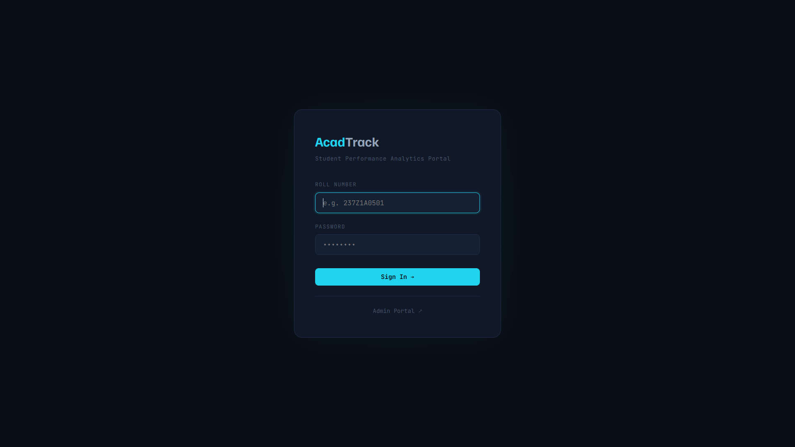 | 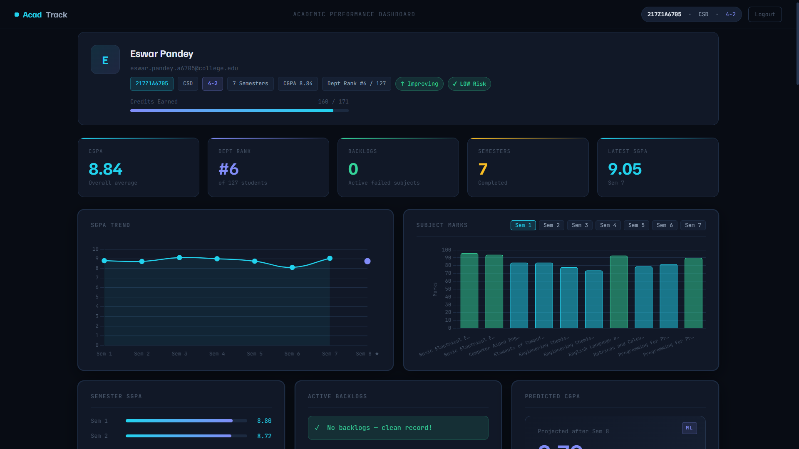 | 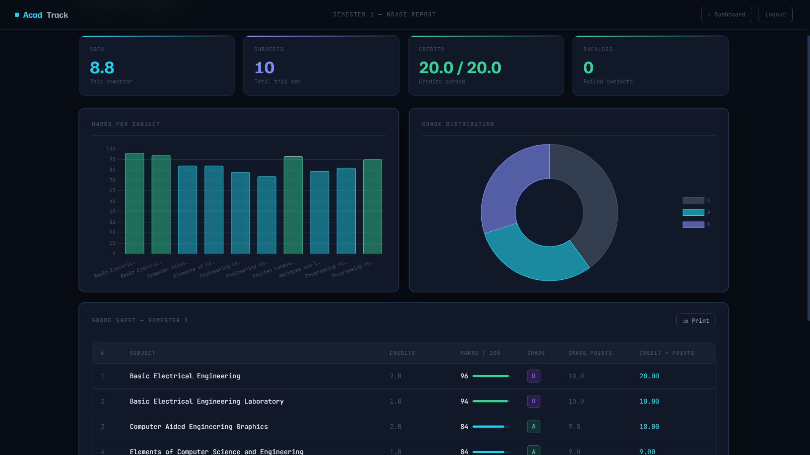 |

| 🔗 Backlog Chain                   | 🛠 Admin Dashboard                   | 🔮 Grade Prediction                   |
| ---------------------------------- | ------------------------------------ | ------------------------------------- |
| 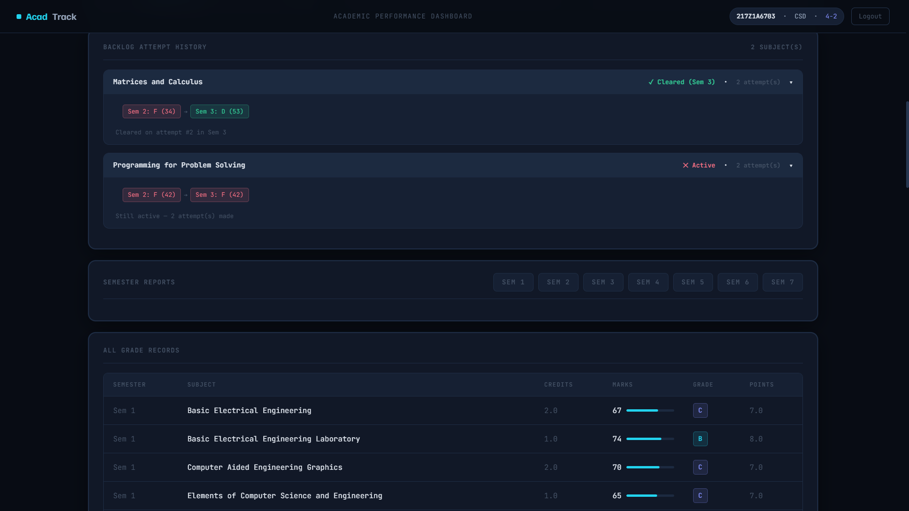 | 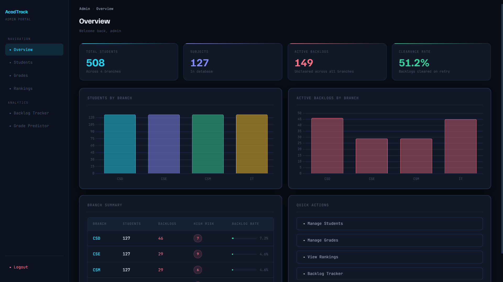 | 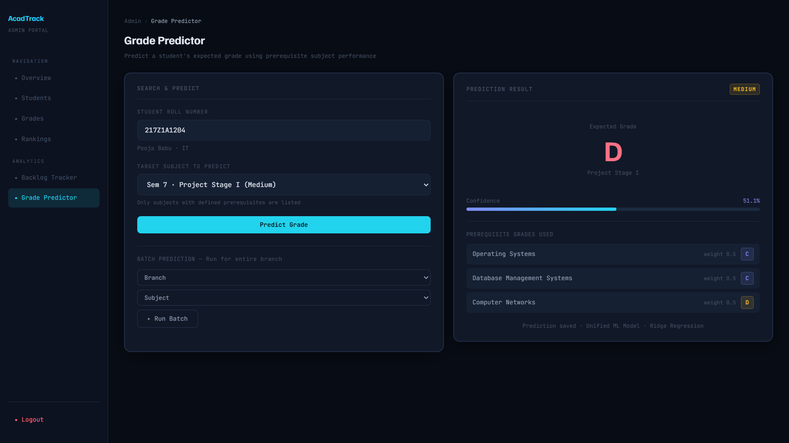 |

| 👥 Student Management                | 📝 Grade Management                | 🏆 Rankings                   |
| ------------------------------------ | ---------------------------------- | ----------------------------- |
| 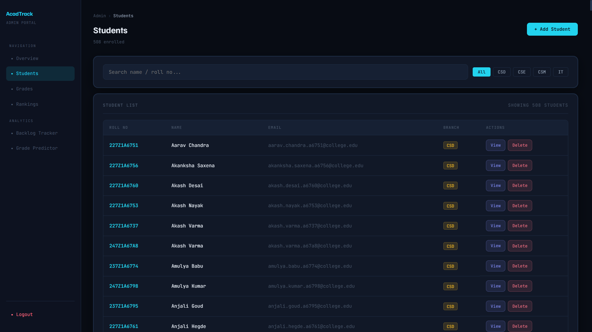 | 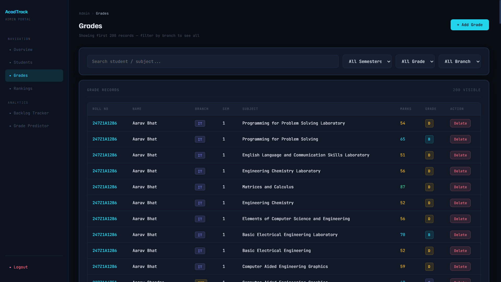 | 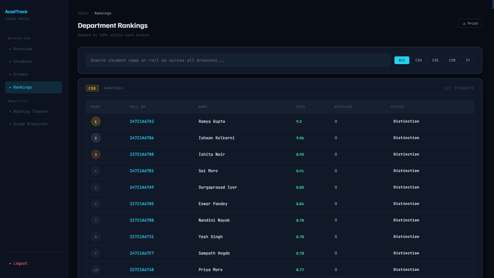 |

| ⚠️ Admin Backlog Tracker      | 👤 Student Profile                   | 📤 Excel Upload               |
| ----------------------------- | ------------------------------------ | ----------------------------- |
| 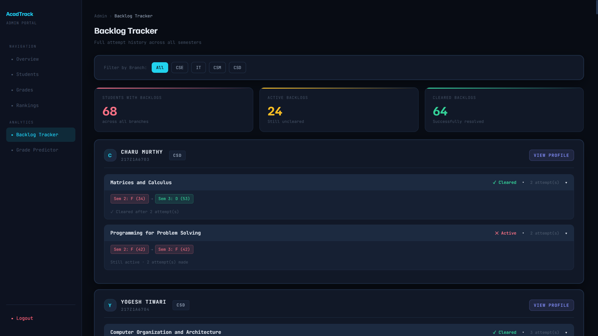 | 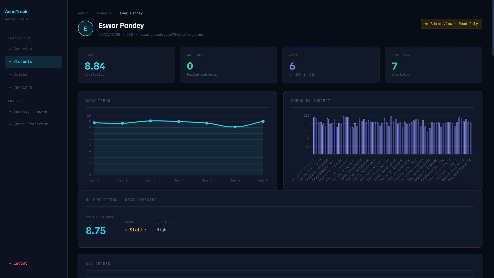 | 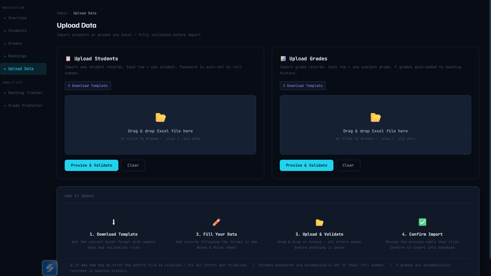   |

---

# ⚙️ Tech Stack

| Layer            | Technology                            |
| ---------------- | ------------------------------------- |
| Backend          | Python 3.10+, Flask                   |
| Database         | MySQL 8.x                             |
| Machine Learning | scikit-learn (Ridge + Random Forest)  |
| Frontend         | HTML5, CSS3, Vanilla JavaScript       |
| Charts           | Chart.js                              |
| Excel Processing | pandas, openpyxl                      |
| Model Storage    | joblib (.pkl files)                   |

---

# 🏗 System Architecture

```
Students / Admin
       │
       ▼
Flask Web Application (app.py)
       │
       ├── Student Routes    → Dashboard, Semester Reports
       ├── Admin Routes      → Students, Grades, Rankings, Backlogs
       ├── Upload Routes     → Excel import with validation & preview
       └── Prediction Routes → Grade Predictor, Batch Prediction
       │
       ▼
MySQL Database (acadtrack_pro)
       │
       ├── 12 Tables
       ├── 3 Helper Views
       └── Optimized indexes
       │
       ▼
Machine Learning Engine
       ├── Ridge Regression  → SGPA Predictor   (cgpa_model.pkl)
       └── Random Forest     → Grade Predictor  (prereq_model.pkl)
```

---

# 📁 Project Structure

```
acadtrack_pro/
│
├── app.py                    # Main Flask application
├── db.py                     # Database connection & query helper
├── train_model.py            # ML model training (optimized bulk queries)
├── requirements.txt
│
├── ml/
│   ├── predictor.py          # Ridge Regression + Random Forest logic
│   ├── cgpa_model.pkl        # Trained SGPA predictor (auto-generated)
│   └── prereq_model.pkl      # Trained grade predictor (auto-generated)
│
├── static/
│   └── css/style.css         # Dark theme stylesheet
│
├── templates/
│   ├── login.html
│   ├── dashboard.html
│   ├── semester_report.html
│   └── admin/
│       ├── admin_panel.html
│       ├── manage_students.html
│       ├── manage_grades.html
│       ├── rankings.html
│       ├── backlogs.html
│       ├── predict.html
│       ├── upload.html       # Excel bulk upload page
│       └── student_profile.html
│
├── screenshots/
│
└── sql/
    ├── 01_schema.sql         # Tables, indexes, views
    ├── 02_seeds.sql          # Subjects, branch mappings, prerequisites, admin
    └── 03_data.sql           # 508 students, grades, backlogs
```

---

# 🗄 Database Schema

The system uses **12 tables** and **3 views**.

| Table                    | Description                              |
| ------------------------ | ---------------------------------------- |
| students                 | Core student records with risk flags     |
| semesters                | Reference table (1–8)                    |
| gradepoints              | O=10, A=9, B=8, C=7, D=6, F=0           |
| subjects                 | 127 subjects across all branches         |
| branch_subjects          | 281 branch-semester subject mappings     |
| subject_prerequisites    | 85 prerequisite relationships            |
| grades                   | All student subject grades               |
| backlog_attempts         | Full attempt chains for failed subjects  |
| student_semester_status  | Semester completion status and SGPA      |
| predictions              | Stored ML grade predictions              |
| prediction_training_data | External ML training data (optional)     |
| admins                   | Admin credentials                        |

### Views

| View              | Purpose                                       |
| ----------------- | --------------------------------------------- |
| v_student_cgpa    | Precomputed CGPA for every student            |
| v_backlog_summary | Active uncleared backlogs with attempt chains |
| v_year_semester   | Year-semester label (e.g. "3-2") per student  |

---

# 📚 Curriculum

Built for **NNRG R22 Regulations** — 4 branches, 8 semesters, **20 credits per semester**, 160 total credits.

| Branch | Code | Full Name                        |
| ------ | ---- | -------------------------------- |
| CSE    | 05   | Computer Science and Engineering |
| IT     | 12   | Information Technology           |
| CSM    | 66   | CS with AI & Machine Learning    |
| CSD    | 67   | CS with Data Science             |

---

# 🤖 Machine Learning Models

## Model 1 — SGPA Predictor (Ridge Regression)

Predicts **next semester SGPA** based on historical performance.

Features used:

* last SGPA
* historical average SGPA
* trend direction (weighted recent 60% / older 40%)
* standard deviation (volatility)
* min / max SGPA
* number of completed semesters

Prediction is **clamped within the student's realistic performance range** to prevent extreme extrapolation.

---

## Model 2 — Grade Predictor (Random Forest)

Predicts **future subject grades** using prerequisite subject performance.

Features used:

* weighted average of prerequisite grades
* best and worst prerequisite grade
* standard deviation of prerequisites
* subject difficulty encoded (Easy=0, Medium=1, Hard=2)
* student CGPA
* number of prerequisites

Training data: **15,000 synthetic + ~7,400 real DB samples = ~22,400 total**

Configuration: `n_estimators=200, max_depth=10, class_weight='balanced', n_jobs=-1`

---

# 🚀 Installation

## Prerequisites

* Python 3.10+
* MySQL 8.x
* pip

---

## Clone Repository

```bash
git clone https://github.com/yourusername/acadtrack_pro.git
cd acadtrack_pro
```

---

## Install Dependencies

```bash
pip install -r requirements.txt
```

`requirements.txt`:
```
flask
pymysql
scikit-learn
joblib
numpy
pandas
openpyxl
```

---

## Configure Database

Edit `db.py`:

```python
DB_CONFIG = {
    'host':     'localhost',
    'user':     'root',
    'password': 'your_password',
    'database': 'acadtrack_pro'
}
```

---

## Setup Database

Run the SQL files in order:

```bash
mysql -u root -p < sql/01_schema.sql
mysql -u root -p < sql/02_seeds.sql
mysql -u root -p < sql/03_data.sql
```

---

## Train Machine Learning Models

```bash
python train_model.py
```

Expected output:

```
=======================================================
AcadTrack — Model Training (Optimized)
=======================================================
[1/2] Building SGPA training data from DB...
    → 384 students with 2+ semesters of data
[ML] SGPA model (Ridge) trained on 1536 samples
    ✓ cgpa_model.pkl saved

[2/2] Building prerequisite grade prediction training data...
    → 15000 synthetic samples generated
    → 7417 real prerequisite training samples from DB
    → 22417 total training samples
[ML] Prereq model (RF balanced) trained on 22417 samples
    ✓ prereq_model.pkl saved

Training complete. Both models are ready.
=======================================================
```

---

## Run Application

```bash
python app.py
```

Open in browser:

```
http://127.0.0.1:5000
```

---

# 🔑 Default Credentials

### Admin

| Username | Password |
| -------- | -------- |
| admin    | admin123 |

---

### Students

Student password = **roll number**

| Roll Number | Branch | Batch |
| ----------- | ------ | ----- |
| 217Z1A0501  | CSE    | 2021  |
| 227Z1A6601  | CSM    | 2022  |
| 237Z1A6701  | CSD    | 2023  |
| 247Z1A1201  | IT     | 2024  |

---

# 🔢 Roll Number Format

```
YY   7Z1A   BB    NNN
│           │     └── Serial: 01–99, then A0–A9, B0–B9...
│           └──────── Branch: 05=CSE, 12=IT, 66=CSM, 67=CSD
└──────────────────── Year of joining (last 2 digits)

Example: 237Z1A0523 = CSE student, joined 2023, serial 23
```

---

# 📊 Dataset Summary

| Metric                          | Value                  |
| ------------------------------- | ---------------------- |
| 👨‍🎓 Total Students            | 508                    |
| 🏫 Branches                     | CSE, IT, CSM, CSD      |
| 📚 Batches                      | 2021, 2022, 2023, 2024 |
| 📖 Subjects                     | 127                    |
| 🗺 Branch Mappings              | 281                    |
| 🔗 Prerequisites                | 85                     |
| 📝 Grade Records                | ~23,700                |
| ⚠️ Students with Backlogs       | ~81 (16%)              |
| 🔗 Backlog Chains (2+ attempts) | ~88                    |
| ✅ Backlog Clearance Rate        | ~72%                   |

Grade distribution:

| Grade | Percentage |
| ----- | ---------- |
| O     | 12%        |
| A     | 20%        |
| B     | 24%        |
| C     | 23%        |
| D     | 13%        |
| F     | 8%         |

---

# 📤 Excel Upload Format

### Students File

| Column           | Required | Example              |
| ---------------- | -------- | -------------------- |
| student_id       | ✅ Yes   | 247Z1A0501           |
| name             | ✅ Yes   | Arjun Reddy          |
| email            | ✅ Yes   | arjun@college.edu    |
| department       | ✅ Yes   | CSE / IT / CSM / CSD |
| current_semester | ✅ Yes   | 1 to 8               |

### Grades File

| Column     | Required | Example            |
| ---------- | -------- | ------------------ |
| student_id | ✅ Yes   | 247Z1A0501         |
| subject_id | ✅ Yes   | 41                 |
| semester   | ✅ Yes   | 3                  |
| marks      | ✅ Yes   | 85                 |
| grade      | ✅ Yes   | O / A / B / C / D / F |

Grade–marks consistency enforced:

```
O = 90–100  |  A = 80–89  |  B = 70–79
C = 60–69   |  D = 50–59  |  F = 0–49
```

---

# 🔄 Retraining Models

After adding new student data or grades, retrain:

```bash
python train_model.py
```

The optimized training script uses **4 bulk SQL queries** instead of per-student loops — completes in seconds regardless of dataset size.

---

# 🔮 Future Improvements

* 📲 Mobile responsive interface
* 🔔 Academic risk email / SMS notifications
* 📊 Attendance analytics integration
* 🧠 Advanced deep learning prediction models
* 🔐 Role-based access control
* 📱 Student mobile app

---

# 👨‍💻 Author

**Harshith Sana**

Academic Software Project — NNRG R22 Regulations

---

# 📄 License

This project is intended for **academic and educational purposes only**.
